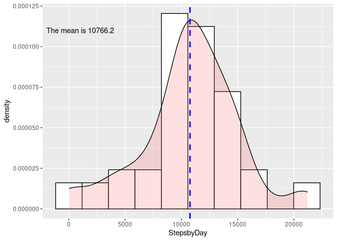
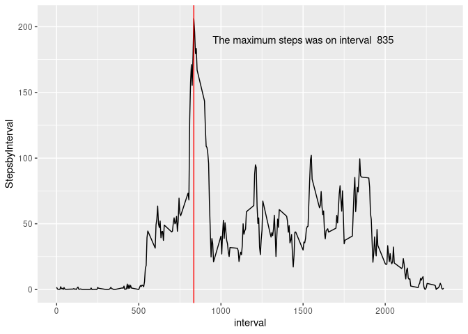
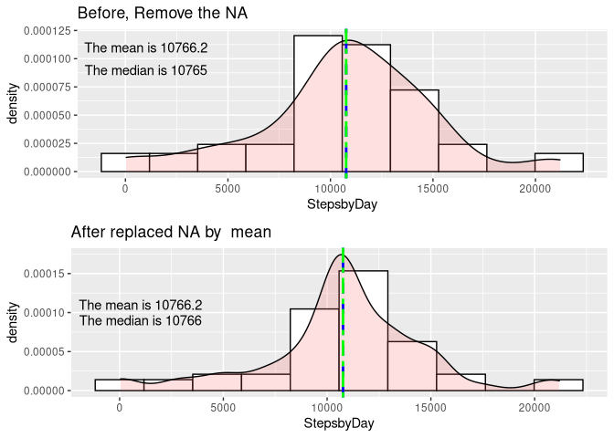
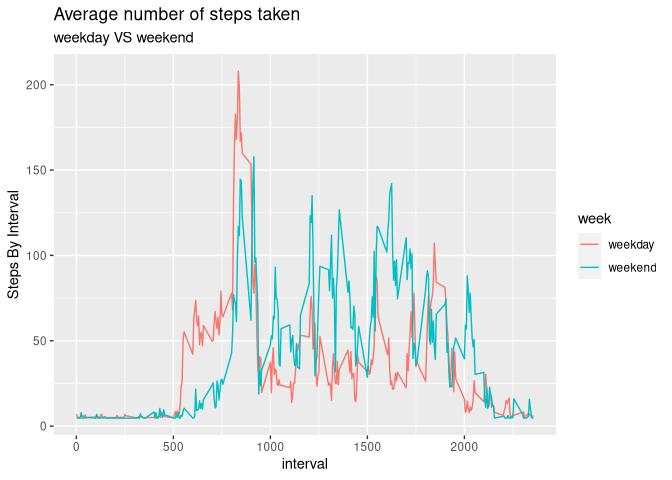

```r
library(tidyverse)
```

```
## ── Attaching packages ──────────────────────────────────────────────────────────────── tidyverse 1.3.0 ──
```

```
## ✓ ggplot2 3.3.1     ✓ purrr   0.3.4
## ✓ tibble  3.0.3     ✓ dplyr   1.0.3
## ✓ tidyr   1.1.2     ✓ stringr 1.4.0
## ✓ readr   1.3.1     ✓ forcats 0.5.0
```

```
## ── Conflicts ─────────────────────────────────────────────────────────────────── tidyverse_conflicts() ──
## x dplyr::filter() masks stats::filter()
## x dplyr::lag()    masks stats::lag()
```

```r
library(knitr)
library(mice)
```

```
## 
## Attaching package: 'mice'
```

```
## The following objects are masked from 'package:base':
## 
##     cbind, rbind
```

```r
library(ggplot2)
require(gridExtra)
```

```
## Loading required package: gridExtra
```

```
## 
## Attaching package: 'gridExtra'
```

```
## The following object is masked from 'package:dplyr':
## 
##     combine
```

```r
options(scipen=999)
```

First I am Read the data for that I need:

-   Uncompress
-   Read in my case using read_csv
-   At same time format date column as date


```r
unzip("activity.zip",exdir = "Data/" )
dir("Data/")
activity <- read_csv("Data/activity.csv", 
                     col_types = cols(date = col_date(format = "%Y-%m-%d")))
```

------------------------------------------------------------------------

## 1 What is mean total number of steps taken per day?

### Calculate the total number of steps taken per day


```r
Steps_day<-activity %>% 
    group_by(date) %>% 
    summarise(StepsbyDay =sum(steps))

kable(Steps_day[1:5,],caption = "Steps by day, first 5 days")
```


Table: Steps by day, first 5 days

date          StepsbyDay
-----------  -----------
2012-10-01            NA
2012-10-02           126
2012-10-03         11352
2012-10-04         12116
2012-10-05         13294

### If you do not understand the difference between a histogram and a barplot, research the difference between them. Make a histogram of the total number of steps taken each day

In the following histogram the bins is equal to 10, to better visibility.

The blue horizontal line is the mean.

I added some density to see the trend


```r
average<-mean(Steps_day$StepsbyDay,na.rm = TRUE)

ggplot(Steps_day, aes(x=StepsbyDay)) + 
    geom_histogram(aes(y = ..density..),bins=10,color="black",fill="white")+
    geom_density(alpha=.2, fill="#FF6666")+ 
    geom_vline(aes(xintercept=average),
               color="blue", linetype="dashed", size=1) +
    annotate(geom = "text",x=1000,y= 0.00011 ,label= paste0("The mean is ",round(average,digits = 1)))
```

<!-- -->

### Calculate and report the mean and median of the total number of steps taken per day


```r
Summary<-summary(Steps_day$StepsbyDay)
Summary
```

```
##    Min. 1st Qu.  Median    Mean 3rd Qu.    Max.    NA's 
##      41    8841   10765   10766   13294   21194       8
```

```r
TotalSteps<-sum(Steps_day$StepsbyDay,na.rm = TRUE)
```

The total steps are 570608.

The mean is 10766.2

The median is 10765

## ------------------------------------------------------------------------

## 2 What is the average daily activity pattern?

### Make a time series plot (i.e. \color{red}{\verb|type = "l"|}type = "l") of the 5-minute interval (x-axis) and the average number of steps taken, averaged across all days (y-axis)


```r
Steps_interval<-activity %>% 
    group_by(interval) %>% 
    summarise(StepsbyInterval =mean(steps,na.rm = TRUE))

maximum_setps<-Steps_interval[which(Steps_interval$StepsbyInterval == max(Steps_interval$StepsbyInterval)),]

ggplot(Steps_interval, aes(x = interval,y=StepsbyInterval))+
    geom_line()+
    geom_vline(xintercept = maximum_setps$interval,color="RED")+
    annotate(geom = "text",x=1500,y= 190 ,label= paste0("The maximum steps was on interval  ",round(maximum_setps$interval,digits = 0)))
```

<!-- -->

### Which 5-minute interval, on average across all the days in the dataset, contains the maximum number of steps?

The maximum steps was 206 for the interval 835

------------------------------------------------------------------------

## Imputing missing values

### Calculate and report the total number of missing values in the dataset (i.e. the total number of rows with \color{red}{\verb|NA|}NAs)


```r
t1<-table(is.na(activity))
t2<-sapply(activity,function(x) sum(is.na(x)))
kable(t1)
```


Var1      Freq
------  ------
FALSE    50400
TRUE      2304

```r
kable(t2)
```

               x
---------  -----
steps       2304
date           0
interval       0
  
As we can see in table above the total missing is 2304. We also can observed all are related column steps. 

### Devise a strategy for filling in all of the missing values in the dataset. The strategy does not need to be sophisticated. For example, you could use the mean/median for that day, or the mean for that 5-minute interval, etc. Create a new dataset that is equal to the original dataset but with the missing data filled in.


```r
comp_activity<-complete(mice(data = activity, m = 1, method = "mean"))
```

```
## 
##  iter imp variable
##   1   1  steps
##   2   1  steps
##   3   1  steps
##   4   1  steps
##   5   1  steps
```

```r
t3<-table(is.na(comp_activity))
kable(t3)
```


Var1      Freq
------  ------
FALSE    52704

Now we do not have any NA.

### Make a histogram of the total number of steps taken each day and Calculate and report the mean and median total number of steps taken per day. Do these values differ from the estimates from the first part of the assignment? What is the impact of imputing missing data on the estimates of the total daily number of steps?


```r
median_p1<-median(Steps_day$StepsbyDay,na.rm = TRUE)
p1<-ggplot(Steps_day, aes(x=StepsbyDay)) + 
    geom_histogram(aes(y = ..density..),bins=10,color="black",fill="white")+
    geom_density(alpha=.2, fill="#FF6666")+ 
    geom_vline(aes(xintercept=average),
               color="blue", linetype="dashed", size=1) +
    annotate(geom = "text",x=1000,y= 0.00011 ,label= paste0("The mean is ",round(average,digits = 1)))+
    geom_vline(aes(xintercept=median_p1),
               color="green", linetype="twodash", size=1) +
    annotate(geom = "text",x=1000,y= 0.00009 ,label= paste0("The median is ",round(median_p1,digits = 1)))+
    ggtitle("Before, Remove the NA")


Comp_Steps_day<-comp_activity %>% 
    group_by(date) %>% 
    summarise(StepsbyDay =sum(steps))

COMP_average<-mean(Comp_Steps_day$StepsbyDay)
median_p2<-median(Comp_Steps_day$StepsbyDay)

p2<-ggplot(Comp_Steps_day, aes(x=StepsbyDay)) + 
    geom_histogram(aes(y = ..density..),bins=10,color="black",fill="white")+
    geom_density(alpha=.2, fill="#FF6666")+ 
    geom_vline(aes(xintercept=average),
               color="blue", linetype="dashed", size=1) +
    annotate(geom = "text",x=1000,y= 0.00011 ,label= paste0("The mean is ",round(COMP_average,digits = 1)))+
        geom_vline(aes(xintercept=median_p2),
               color="green", linetype="twodash", size=1) +
    annotate(geom = "text",x=1000,y= 0.00009 ,label= paste0("The median is ",round(median_p2)))+
    ggtitle("After replaced NA by  mean")

grid.arrange(p1, p2, nrow = 2)
```

<!-- -->

We can verify a small difference in median. The mean is the same because I use the mean to replace the NA.

------------------------------------------------------------------------

## Are there differences in activity patterns between weekdays and weekends?

### Create a new factor variable in the dataset with two levels – “weekday” and “weekend” indicating whether a given date is a weekday or weekend day.


```r
comp_activity$week<- as.factor(ifelse(weekdays(comp_activity$date) %in% c("Saturday", "Sunday"), "weekend", "weekday"))
head(comp_activity$week)
```

```
## [1] weekday weekday weekday weekday weekday weekday
## Levels: weekday weekend
```

### Make a panel plot containing a time series plot (i.e. \color{red}{\verb|type = "l"|}type = "l") of the 5-minute interval (x-axis) and the average number of steps taken, averaged across all weekday days or weekend days (y-axis). See the README file in the GitHub repository to see an example of what this plot should look like using simulated data.


```r
Steps_interval<-comp_activity %>% 
    group_by(interval,week) %>% 
    summarise(StepsbyInterval =mean(steps))
```

```
## `summarise()` has grouped output by 'interval'. You can override using the `.groups` argument.
```

```r
ggplot(Steps_interval, aes(x = interval,y=StepsbyInterval,color=week))+
    geom_line()+
    labs(subtitle = "weekday VS weekend", 
         title = "Average number of steps taken")+
    ylab(label = "Steps By Interval")
```

<!-- -->
 
